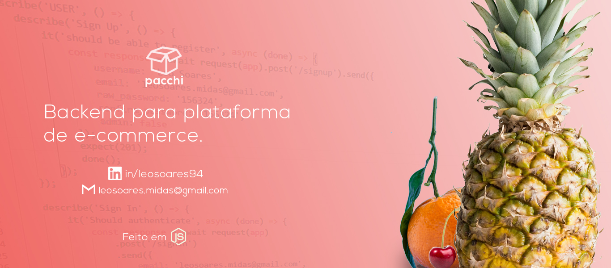

<h1>Pacchi E-commerce Server</h1>

This is a simple back-end of the Pacchi Shop app 

A simple RESTful API built with NodeJS + Express + Postgresql that retrieves all data from products. It also provides sign up and sign in functionalities, in addition of update and delete users or products.

It also separates access of routes by administrative privileges.

<h2>About this project</h2>

This project is part of my personal portfolio, so, every feedback is welcome.

E-mail me: leosoares.midas@gmail.com

